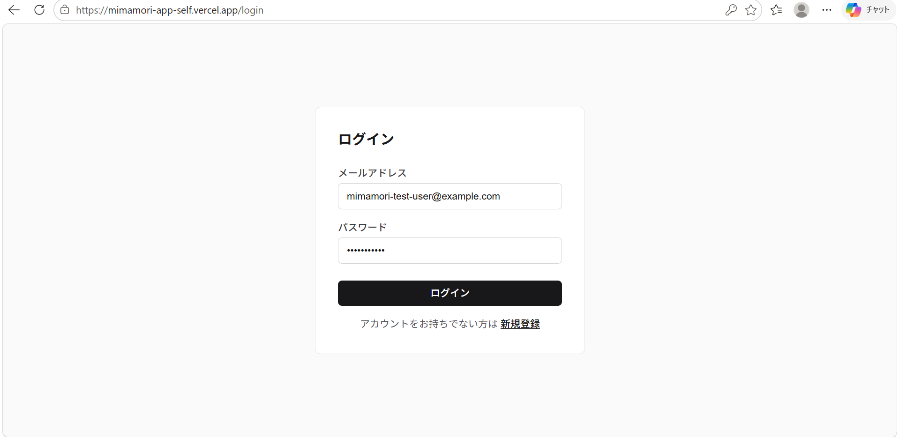
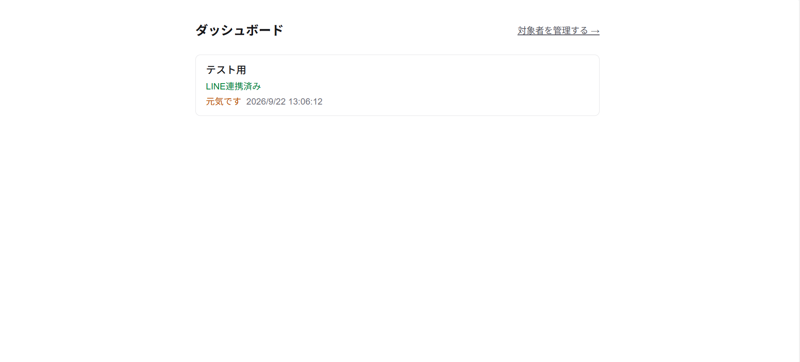
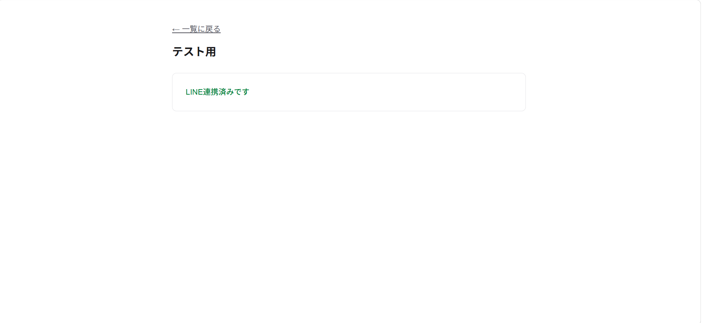

# 見守り安否確認

離れて暮らす高齢の家族の安否を、LINEの通知応答とWebダッシュボードで確認できるサービスです。

## 解決したい課題

- **困りごと**: 離れて暮らす高齢の家族の安否が気になっても、毎日電話するのはお互いに負担になる。かといって何もしないと、異変に気づくのが遅れることもある。
- **誰の課題か**:
  - 見守られる高齢者本人 → スマホ操作が苦手でも、毎朝の通知にボタン1つで応答できれば負担なく安否を伝えられる
  - 見守る家族 → 毎日電話しなくても、対象者の最終応答状況をダッシュボードで一目確認でき、応答がない場合はアラートで早く異変に気づける

## 技術スタック

- **フロントエンド/バックエンド**: Next.js (App Router, TypeScript), Tailwind CSS
- **DB / 認証**: Supabase (PostgreSQL, Auth, RLS)
- **通知**: LINE Messaging API
- **デプロイ**: Vercel
- **定期実行**: GitHub Actions（朝の安否確認通知・未応答チェックをcron実行）

## 主な機能（MVP）

| ID | 機能名 | 内容 |
|---|---|---|
| F-01 | 朝の安否確認通知 | LINEで毎朝決まった時刻に安否確認の通知を送る |
| F-02 | 応答ボタン（元気です） | 通知に対しボタン1つで応答できる |
| F-03 | 家族アカウント登録・ログイン | メールアドレスで家族が管理画面にログインできる |
| F-04 | 見守り対象者登録 | 家族が見守る相手（高齢者）を登録し、LINE連携用コードを発行できる |
| F-05 | 対象者一覧・最終応答状況表示 | ダッシュボードで対象者ごとの最終応答状況を表示する |
| F-06 | 未応答時のアラート通知 | 一定時間応答がない場合、家族にアラートを記録・通知する |

その他の詳細な要件・画面遷移は [`requirements.md`](./requirements.md) を参照してください。

## 公開URL

https://mimamori-app-self.vercel.app/

## ローカルでの動かし方

### 1. 依存パッケージのインストール

```bash
npm install
```

### 2. 環境変数の設定

プロジェクトルートに `.env.local` を作成し、以下を設定してください（Git管理対象外）。

```bash
# Supabase
NEXT_PUBLIC_SUPABASE_URL=
NEXT_PUBLIC_SUPABASE_ANON_KEY=
SUPABASE_SERVICE_ROLE_KEY=

# LINE Messaging API
LINE_CHANNEL_ACCESS_TOKEN=
LINE_CHANNEL_SECRET=

# 定期実行APIの認証用（任意の文字列を生成して設定）
CRON_SECRET=
```

- `NEXT_PUBLIC_SUPABASE_URL` / `NEXT_PUBLIC_SUPABASE_ANON_KEY` : SupabaseプロジェクトのAPI設定から取得
- `SUPABASE_SERVICE_ROLE_KEY` : RLSをバイパスする管理者キー。LINE WebhookやCronルートなど、ユーザーセッションを持たないサーバー処理でのみ使用
- `LINE_CHANNEL_ACCESS_TOKEN` / `LINE_CHANNEL_SECRET` : LINE Developersコンソールの Messaging API チャネルから取得
- `CRON_SECRET` : `/api/cron/*` を呼び出す際の `Authorization: Bearer <CRON_SECRET>` ヘッダーの検証に使用

### 3. 開発サーバーの起動

```bash
npm run dev
```

[http://localhost:3000](http://localhost:3000) を開いて動作を確認できます。

### 4. その他のコマンド

```bash
npm run build   # 本番ビルド
npm run start   # 本番サーバー起動（要build）
npm run lint    # ESLint
```

## スクリーンショット

### ログイン画面



### ダッシュボード



### 対象者ページ


